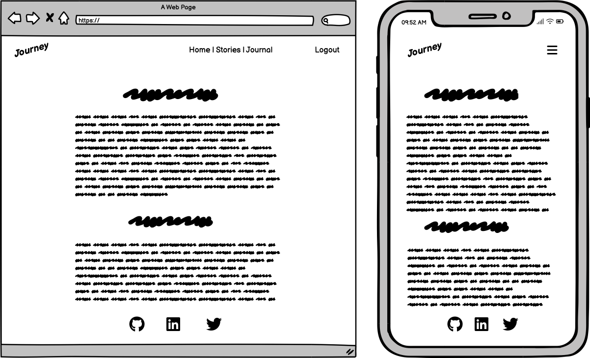
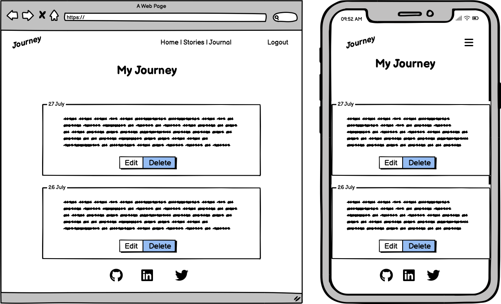
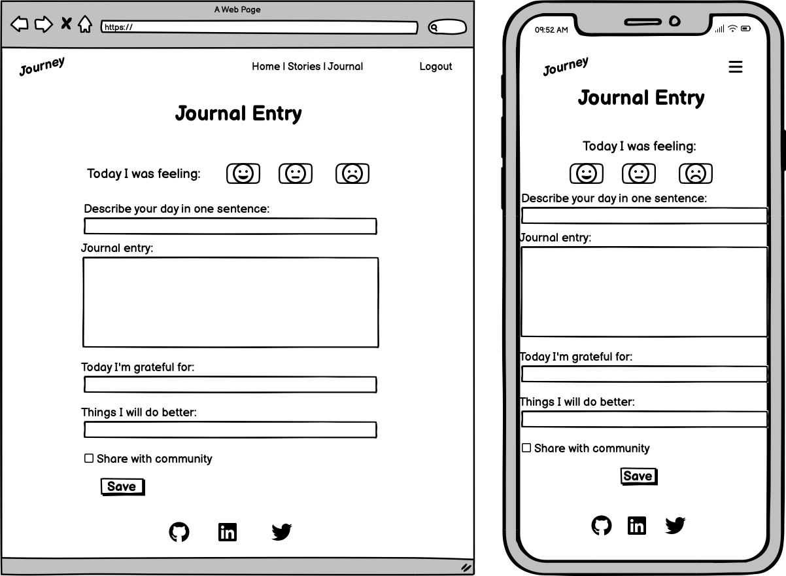

# Journey

"Journey" is a journalling app with a twist. This application, built using the Django framework, allows users to journal their moods, daily events and their progress. Embark on a journaling journey where you can reflect on your experiences and personal growth whether you want to record your thoughts or track your mood and achievements. This app features a unique function where users can anonymously let go of their worries or share their happy moments by publishing their diary entries (stories).

**[Link to the deployed application](https://journey-journaling-app-57914ad778ff.herokuapp.com/)**

## Index

- [Project Inception](#project-inception)
- [User Stories](#user-stories)
- [Strategy](#strategy)
- [Scope](#scope)
- [Structure](#structure)
- [Skeleton](#skeleton)
  - [Wireframes](#wireframes)
- [Surface](#surface)
    - [Fonts](#fonts)
    - [Colours](#colours)
- [Security](#security)
- [Features](#features)
- [Future Features](#future-features)
- [Database Schema](#database-schema)
  -[Entity Relationship Diagram](#entity-relationship-diagram)
- [Agile](#agile)
- [Deploying Project to Heroku](#deploying-project-to-heroku)
- [Technologies Used](#technologies-used)
- [Credits](#credits)
- [Testing](#testing)

## Project Inception

Sometimes we have that pure and genuine connection with our journal, where we confide our deepest and truest secrets or our biggest and darkest fears. But what if keeping these thoughts in becomes too heavy? What if there is no one to share them with, or sharing them feels too scary? And what if sharing your stories, fears, and achievements could help and encourage others?

Imagine if there were a way to share your achievements safely and anonymously, without the fear of judgment. What if you didn't have to hold on to the weight of your experiences all by yourself? Journey allows you to safely let go of these burdens. Share your stories and connect with others in a meaningful way, all while maintaining your anonymity.

It's like a journey full of stories, strangers, and people we encounter on our way, whom we may never meet again. In your wanderings with strangers, sometimes your stories are the purest and truest, and they can be shared and left with strangers you will never meet again. We are wise and interesting, just sometimes too shy or lost to realize it. Talking things out is the best therapy, and Journey creates that space for us. 

Journey is for the lonely, shy, scared, silent, brave, radiant, energetic, and loving. Journey is for you.

## User Stories

### Epic 1: User Authentication
As a user, I want to create an account and log in, so that I can have a private journaling experience.

- **As a user**, I want to register for an account, so that I can start using the personal journal.
- **As a user**, I want to log in to my account, so that I can access my private journal entries.
- **As a user**, I want to log out of my account, so that I can ensure my journal entries are secure when I'm finished.

### Epic 2: Homepage Experience
As a user, I want to understand the purpose of Journey.

- **As a user**, I want to read the website introduction on the homepage, so I can understand the purpose and ideas behind the website.
- **As a user**, I want to access instructions on the homepage, so I can easily learn how to use the website.

### Epic 3: Navigation & Layout
As a user, I want a smooth navigation experience across the site, so I can access features easily.

- **As a user**, I want to find a navigation menu, so I can easily move between different sections of the website.
- **As a user**, I want to access social links, so I can contact or learn more about the developer.
- **As a user**, I want to click the website logo, so I can quickly return to the homepage from any page.

### Epic 4: My Journal
As a user, I want to view and manage my journal entries.

- **As a user**, I want to have an overview of all my journal entries, so I can easily access and manage them.
- **As a user**, I want to create a new journal entry, so I can document my thoughts and moods.
- **As a user**, I want to update my journal entries, so I can make corrections.
- **As a user**, I want to delete any of my journal entries, so I can remove content that I don't want to keep.
- **As a user**, I can mark journal entries as public, so I can share my pain or achievements with the community anonymously.

### Epic 5: Community Stories
As a user, I want to connect with others through shared experiences.

- **As a user**, I want to read stories shared by other community members, so I can feel connected, find inspiration, or gain reassurance that I am not alone in my experiences.

### Epic 6: Administrator Controls
As an administrator, I want to manage and monitor content, so I can maintain a safe environment.

- **As an administrator**, I can update the homepage content, so that I can ensure the information and instructions presented to users are current and accurate.
- **As an administrator**, I can review and approve user stories before they are published on the Community Stories page, so that I can prevent unsafe content from being shared with the community.
- **As an administrator**, I can update published user stories, so that I can make necessary edits or corrections to the content that has been shared.
- **As an administrator**, I can delete published user stories, so that I can remove any content that violates the platform’s rules after it has been published.

## Strategy 

The Journey website focuses on addressing the emotional and psychological needs of its users. The goal of the website is to provide a safe and supportive space for personal journaling, allowing users to reflect on their daily experiences, track their emotions, and connect with a community in an anonymous way. The objectives of Journey are as follows:

- **User Empowerment:** Empower users by providing a platform where they can document their thoughts, moods, and experiences, promoting self-reflection and personal growth.
- **Anonymity and Safety:** Users can share their stories and experiences anonymously, creating a safe environment free from judgment or fear of exposure.
- **Community:** Create a sense of community by enabling users to share their stories with others, helping them feel less isolated and more connected to people who are experiencing similar challenges.
- **Ease of Use:** Design the website to be intuitive and user-friendly, so users can easily access features, navigate the platform, and focus on journaling without distractions.
- **Emotional Well-being:** Support the emotional well-being by providing a private space to analyze and constructively document their thoughts and feelings.

## Scope

The Journey website includes features and functionalities designed to meet the objectives of the user. These features are developed with a focus on usability and accessibility. The scope of the Journey website includes:

- **Homepage Introduction:** A welcoming and informative homepage that introduces users to the idea and purpose of Journey, setting a warm and inviting tone for the user experience.
- **User Authentication:** Secure login, registration, and logout functionalities, enabling users to create personal accounts where they can manage their journal entries.
- **Journal Entry Management:** Tools for creating, editing, and deleting journal entries. Users can document their daily thoughts and experiences privately.
- **Anonymous Sharing:** A feature allowing users to mark specific journal entries as public, sharing them safely and anonymously with the community without revealing their identity.
- **Community Stories:** A section where users can read stories shared by others in the community, helping them find inspiration, reassurance, and a sense of belonging.
- **Navigation and Layout:** An intuitive navigation structure, including a menu, social links, and a clickable logo that returns users to the homepage. This ensures that users can easily find their way around the website.
- **Responsive Design:** A layout that adapts seamlessly to various screen sizes and devices, ensuring a consistent user experience whether accessed on a desktop, tablet, or mobile device.

## Structure

The Journey website is designed with a clear and consistent structure that enhances user navigation and interaction across all pages. 

### Navigation Bar
- The navigation bar is located at the top of every page, providing links to the Homepage, My Journey, and Community Stories.
- Depending on the user’s authentication status, the navigation bar will display either Login/Register or Logout links.
- A footer containing social links is also present across all pages, allowing users to connect with the developer through the social links.

### Pages Overview
- **Homepage:** The welcome page where users can read the website introduction, access instructions, and navigate to other areas, such as their journal or community stories.
- **My Journey:** A personalized dashboard where users can view and manage all their journal entries. Users can create new entries, edit or delete existing ones, and mark entries as public for anonymous sharing.
- **Community Stories:** A section dedicated to anonymously shared stories from other users, organized by most recent entries, enabling easy browsing and exploration.
- **Journal Entry:** A dedicated page containing a form for creating or editing journal entries, allowing users to document their thoughts and experiences.
- **Authentication Pages:** Separate pages for login and registration, ensuring users can easily access their accounts.

### User Flow
- **Homepage to Journaling:** Users start on the homepage, where they are introduced to the app. From here, they can easily log in or register and navigate to My Journey page where they can create a new journal entry or access their existing entries.
- **Journal Entry Management:** Users can manage their journal entries from the My Journey dashboard. They can create, edit, or delete entries, with the interface providing immediate feedback on successful actions or alerting users in case of any issues.
- **Anonymous Sharing:** When marking an entry as public, users go through a confirmation process that ensures their story will be shared anonymously with the community. This ensures that users can share their experiences without fear of identity exposure.
- **Form Validation:** The forms for creating or editing journal entries include validation checks, alerting users to issues such as missing content or invalid inputs before submission.
- **Deletion Confirmation:** When a user requests to delete a journal entry, a delete confirmation will appear, asking the user to confirm the deletion. This extra step ensures that entries are not accidentally deleted.

## Skeleton

### Wireframes

- **Home page**

- **Stories**

- **My Journey**

- **Journal Entry**

## Surface

The Surface design of the Journey website creates a warm, natural, and welcoming atmosphere that aligns with the theme of journaling and personal reflection.

### Colours

- **#FFC9B9** - This soft, warm colour represents the sun setting at the end of a day, evoking a sense of calm and reflection. It’s used to create a soothing backdrop, symbolizing the peaceful moments when users sit down to journal.
- **#0E3B02** - A deep green shade, reminding of forest treetops and the rich greenness of moss. This color adds depth and a connection to nature, grounding the user experience in a sense of tranquility and growth. It has a contrast ratio of 12.76 with white (#FFFFFF), 8.70 with #FFC9B9, and 8.02 with #B7D799.
- **#B7D799** - A lighter green is used for accents. This colour highlights elements and draws attention in a way that feels fresh, complementing the deeper green tones.

### Typography

- **[Sacramento](https://fonts.google.com/specimen/Sacramento)** - A beautiful handwriting font from Google Fonts, Sacramento is used exclusively for the website logo. Its elegant style captures the essence of writing by hand, making it a perfect representation of journaling experience.
- **[Cutive Mono](https://fonts.google.com/specimen/Cutive+Mono)** - This typewriter style font is used for headers, complimenting the journaling theme. While maintaining a clear and readable style, Cutive Mono adds a nostalgic touch that reminds users of old-school typewritten books.
- **[Work Sans](https://fonts.google.com/specimen/Work+Sans)** - As the general-purpose font for body text, Work Sans offers a clean and modern reading experience. Its slightly rounded edges and simple style make it easy on the eyes, while still carrying a subtle hint of the typewriter influence from Cutive Mono, ensuring a smooth visual transition.

## Features

Journey features are designed to facilitate personal reflections while ensuring user privacy and community engagement. Below is an overview of the main functionalities of the app:

### Navigation Bar
- **Unregistered Users**: The navigation bar displays links to the Home page and Stories page, along with options to register or sign in if the user is not logged in.
- **Logged-in Users**: When users are logged in, they have access to the Home page, Stories page, and Journal page. The navigation bar will then display a logout link.

### Home Page
- **Access for Unregistered Users**: The Home page is accessible to everyone, allowing unregistered users to explore the app.
- **Sections**:
  - **Introduction**: Describes the idea behind Journey, encouraging personal reflection and growth through journaling.
  - **Instructions**: Provides guidance on how to use the app.

### Stories Page
- **Community Stories**: This page displays journal entries that users have chosen to publish publicly. It is accessible to both registered and unregistered users. Each story is stripped of any identifying user information, showcasing only the content and the date it was published.

### Journal Page (Logged-in Users Only)
- **User Privacy**: Each user’s journal entries are private and only accessible by the logged-in user. Admins do not have access to view or manipulate user journal entries.
- **Search Functionality**: A search box allows users to easily find specific journal entries by keywords.
- **Add Entry Button**: Users can create new journal entries using the "New Entry" button.
- **List of Journal Entries**: Displays user entries in a single column for easy scrolling. Each entry is clickable, leading to a detailed view.

### Add Journal Entry Page
- **Entry Form**:
  - **How do I feel today?**: Users can select their mood from a dropdown list containing three options: Happy, Normal, and Sad.
  - **Sum up my day in 5 words**: A field for users to summarize their day in 5 words or less.
  - **My day's story**: An area for users to write the main content of their diary entry.
  - **What am I thankful for today?**: Users can list things they are grateful for.
  - **How can I be better tomorrow?**: A section for users to express what they would like to do better tomorrow.
  - **Share this entry with the community?**: An option to tick if the user wants to share their entry in the community stories.

### Edit Journal Entry Page
- The layout is the same as the New Entry form, allowing users to modify their existing journal entries.

### Delete Journal Entry Confirmation
- When users click the delete button, a confirmation page appears, requiring them to confirm their choice to delete the entry.

### Django Admin Panel
- The Django admin panel allows for management of the app's content but restricts access to journal entries. Admins can:
  - **Manage Home Content**: Update the instructions and change the introduction displayed on the Home page to ensure information is relevant.
  - **Approve Stories**: Review story entries for publication in the community stories. Admins can see only the journal content field of each entry, without access to other fields or user information. This ensures privacy and security, maintaining the core highlight of the app.

### Authorization Pages
- **403 Page**: This page informs users when they attempt to access restricted content, with a button to return to the home page.
- **Sign-out Confirmation Page**: A page that confirms the user’s choice to log out of the application.
- **Registration Page**: A page where new users can sign up for an account.
- **Sign-in Page**: A page where existing users can log into their accounts.

### Footer
- **Social Links**: The footer includes links to the developer's social media profiles: GitHub, Twitter, and LinkedIn.

## Future Features

1. **User Profile Customization**:
   - Allow users to add personal information and upload profile pictures.

2. **Tags for Journal Entries**:
   - Implement a tagging system so users can categorise their journal entries, making it easier to find specific entries later.

3. **Reminders**:
   - Implement a feature for users to set daily or weekly reminders to encourage them to write in their journal regularly.

4. **Customizable Entry Templates**:
   - Create a few templates for users to choose from when starting a new journal entry (e.g., "Daily Reflection," "Gratitude List").

5. **Simple Analytics Dashboard**:
   - Provide users with a dashboard displaying insights like the number of entries written over time or the most common moods tagged.

6. **User Feedback System**:
    - Create a simple feedback form for users to share their thoughts on the app and suggest new features.

## Database Schema

## Agile

The Journey project follows Agile methodology to enhance planning and management throughout the development process. It began with brainstorming and the creation of Epics, which were later broken down into user stories.

These user stories were then used on the project board within GitHub Projects, which was maintained with three columns:
- **To Do**: For user stories that need to be started.
- **In Progress**: For user stories that are currently being worked on.
- **Done**: For user stories that have been completed.

Each user story included acceptance criteria to define what must be completed for the story to be considered done. User stories were added to the project board through the GitHub Issues section, allowing for easy tracking and updates. The project board can be viewed [here](https://github.com/users/niekados/projects/5).

Additionally, the MoSCoW prioritization method was employed, which helped categorize user stories into four groups:
- **Must have**: Critical features for the app's success.
- **Should have**: Important features that add significant value but are not critical.
- **Could have**: Nice-to-have features that can enhance the user experience if time allows.
- **Won't have**: Features that are not a priority for this project cycle but may be revisited in the future.

This approach enabled better organization, focus, and responsiveness to changing requirements during the development of Journey.

## Technologies Used

Journey utilizes a range of technologies and libraries to create a seamless user experience. Here’s a list of the key technologies used:

- **HTML**: The markup language for creating web pages. [Learn more](https://developer.mozilla.org/en-US/docs/Web/HTML)

- **CSS**: A stylesheet language that styles the HTML content. [Learn more](https://developer.mozilla.org/en-US/docs/Web/CSS)

- **Bootstrap 5**: A framework that provides responsive design components and utilities. [Learn more](https://getbootstrap.com)

- **FontAwesome**: An icon toolkit that provides scalable vector icons for the application. [Learn more](https://fontawesome.com)

- **Python**: The programming language used for backend development in Journey. [Learn more](https://www.python.org)

- **Django 4.2.15**: A Python web framework that simplifies web application development. [Learn more](https://www.djangoproject.com)

- **PostgreSQL from Code Institute**: An open-source relational database system used to store app data and user entries, with storage provided by [Code Institute](https://dbs.ci-dbs.net/). [Learn more](https://www.postgresql.org)

- **GitHub**: A platform for version control and code storage. [Learn more](https://github.com)

- **Gitpod**: Cloud based IDE. [Learn more](https://www.gitpod.io)

- **Google Fonts**: A collection of fonts that enhance typography in the app. [Learn more](https://fonts.google.com)

- **Balsamiq**: A wireframing tool. [Learn more](https://balsamiq.com)

- **Lucidchart**: A diagramming application used to create ERDs. [Learn more](https://www.lucidchart.com)

- **Crispy-Bootstrap5**: A Django app for easily using Bootstrap styles with forms (v2024.2). [Learn more](https://django-crispy-forms.readthedocs.io/en/latest/)

- **Django Allauth**: A library for handling user registration and authentication (v0.57.2). [Learn more](https://docs.allauth.org/en/latest/index.html)

- **Django RichTextField**: A library that allows for rich text editing in Django forms (v1.6.2), used with the free public version of CKEditor (v4.22.1). Note: This version is under an open-source license but does not receive security updates [Learn more](https://pypi.org/project/django-richtextfield/)

- **Django Crispy Forms**: A library that enhances Django forms for better styling (v2.3). [Learn more](https://django-crispy-forms.readthedocs.io/en/latest/)

- **Favicon Generator**: A tool to create favicons from FontAwesome icons. [Favicon Generator](https://gauger.io/fonticon/)

- **Colour Contrast Checker**: A tool to check color contrast for accessibility. [Learn more](https://colourcontrast.cc)

