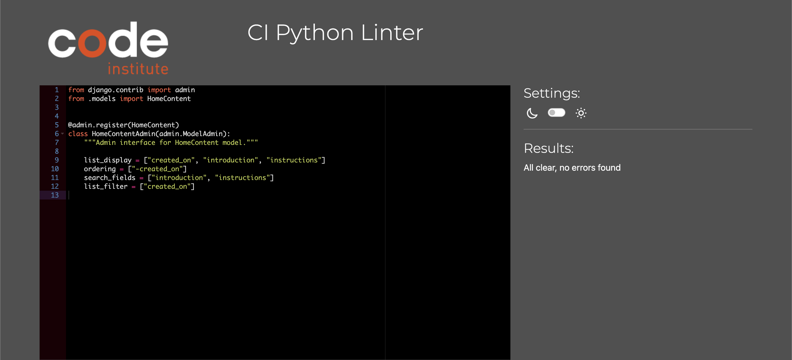
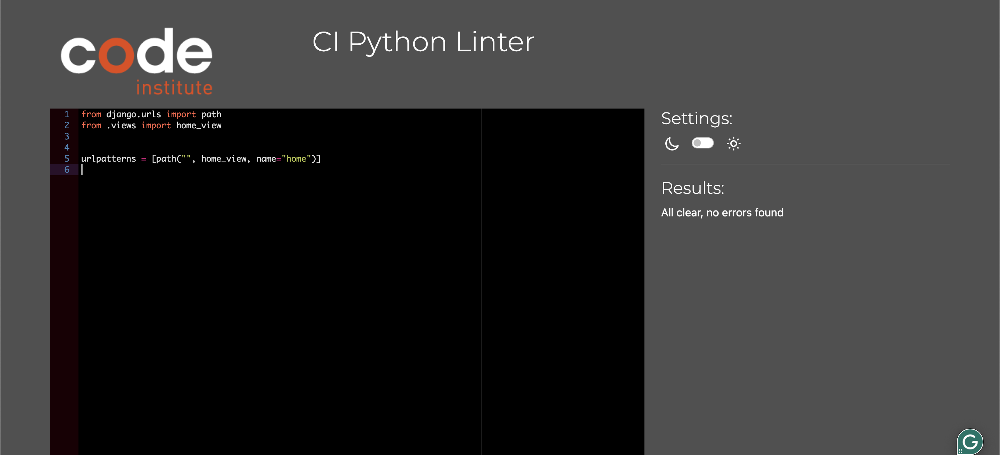

# Testing

## Index

- [Validation](#validation)
    - [HTML Validation](#html-Validation)
    - [CSS Validation](#css-validation)
    - [PEP8 Validation](#pep8-validation)
    - [Lighthouse Testing](#lighthouse-testing)
- [Testing User Stories](#testing-user-stories)
- [Manual Testing](#manual-testing)
- [Bugs](#bugs)
- [Known Bugs](#known-bugs)

## Validation

### HTML Validation

The HTML code for the Journey app was validated using the [W3C Markup Validation Service](https://validator.w3.org/). 

- **Validation Method**:
  - URI validation was employed for all pages that did not require user login.
  - Direct input validation was used for pages that required a login. The HTML code was extracted by viewing the page's source directly. 

During the validation process, a few warnings were noted, specifically regarding the "Possible misuse of aria-label." This warning was due to the use of aria-labels for FontAwesome icons. 

Despite the warnings, the errors were intentionally left as they are, as the use of aria-labels serves a purpose. When creating a journal entry, users select their mood for the day, which is later represented by FontAwesome emojis on the journal cards. Using emojis to convey mood is an integral part of the design. Not including the aria-label would result in assistive technology users missing important information regarding their mood selection.

- Home Page
    - 

- Community Stories
    - 

- Journal Page
    - 

- Journal Entry Detail
    - 

- Edit Journal Entry
    - 

- Delete Journal Entry Confirmation
    - 

- Add Journal Entry
    - 

- Sign In Page
    - 

- Sign Up Page
    - 

- Sign Out Page
    - 

- Error 403
    - 

### CSS Validation

The CSS code for the Journey app was validated using the [W3C CSS Validation Service](https://jigsaw.w3.org/css-validator/).

### PEP8 Validation

The Python code for the Journey app was checked for PEP8 compliance using the [Code Institute's Python Linter Tool](https://pep8ci.herokuapp.com/).

#### Home

- admin.py
    - 

- models.py
    - 

- views.py
    - 

- urls.py
    - 

#### Stories

- admin.py
    - 

- models.py
    - 

- views.py
    - 

- urls.py
    - 

#### Journal

- admin.py
    - 

- models.py
    - 

- views.py
    - 

- forms.py
    - 

- urls.py
    - 

#### Journey (project)

- urls.py
    - 

### Lighthouse Testing

Lighthouse, a tool provided by Google Chrome DevTools, was used to audit the Journey app's performance, accessibility, best practices, SEO, and progressive web app (PWA) features. 

During the testing of the 403 error page (a feature of the app), a warning was received: "Lighthouse was unable to reliably load the page you requested. Make sure you are testing the correct URL and that the server is properly responding to all requests. (Status code: 403)." This warning is expected, as the page returns a 403 status, indicating that access is forbidden. The warning was left as is, and no further action was taken.

- Home Page
    - Mobile
        - 
    - Desktop
        - 

- Community Stories
    - Mobile
        - 
    - Desktop
        - 

- Journal Page
    - Mobile
        - 
    - Desktop
        - 

- Journal Entry Detail
    - Mobile
        - 
    - Desktop
        - 

- Edit Journal Entry
    - Mobile
        - 
    - Desktop
        - 

- Delete Journal Entry Confirmation
    - Mobile
        - 
    - Desktop
        - 

- Add Journal Entry
    - Mobile
        - 
    - Desktop
        - 

- Sign In Page
    - Mobile
        - 
    - Desktop
        - 

- Sign Up Page
    - Mobile
        - 
    - Desktop
        - 

- Sign Out Page
    - Mobile
        - 
    - Desktop
        - 

- Error 403
    - Mobile
        - 
    - Desktop
        - 

## Testing User Stories

### Epic 1: User Authentication
As a user, I want to create an account and log in, so that I can have a private journaling experience.

- **As a user**, I want to register for an account, so that I can start using the personal journal.
    - ✔ The user can sign up using the sign-up page.

- **As a user**, I want to log in to my account, so that I can access my private journal entries.
    - ✔ The user can log in using the sign-in page.

- **As a user**, I want to log out of my account, so that I can ensure my journal entries are secure when I'm finished.
    - ✔ The user can log out using the sign-out page.

### Epic 2: Homepage Experience
As a user, I want to understand the purpose of Journey.

- **As a user**, I want to read the website introduction on the homepage, so I can understand the purpose and ideas behind the website.
    - ✔ Introduction is available on the homepage.

- **As a user**, I want to access instructions on the homepage, so I can easily learn how to use the website.
    - ✔ Instructions are available on the homepage.

### Epic 3: Navigation & Layout
As a user, I want a smooth navigation experience across the site, so I can access features easily.

- **As a user**, I want to find a navigation menu, so I can easily move between different sections of the website.
    - ✔ A navigation bar is implemented on each page.

- **As a user**, I want to access social links, so I can contact or learn more about the developer.
    - ✔ Social links are available in the footer on each page.

- **As a user**, I want to click the website logo, so I can quickly return to the homepage from any page.
    - ✔ The user can return to the homepage using the website logo on each page.

### Epic 4: My Journal
As a user, I want to view and manage my journal entries.

- **As a user**, I want to have an overview of all my journal entries, so I can easily access and manage them.
    - ✔ The user can see all journal entries on the My Journal page.

- **As a user**, I want to create a new journal entry, so I can document my thoughts and moods.
    - ✔ The user can create new entries on the My Journal page.

- **As a user**, I want to update my journal entries, so I can make corrections.
    - ✔ The user can update entries on the My Journal page.

- **As a user**, I want to delete any of my journal entries, so I can remove content that I don't want to keep.
    - ✔ The user can delete entries on the My Journal page.

- **As a user**, I can mark journal entries as public, so I can share my pain or achievements with the community anonymously.
    - ✔ The user can mark entries as public.

### Epic 5: Community Stories
As a user, I want to connect with others through shared experiences.

- **As a user**, I want to read stories shared by other community members, so I can feel connected, find inspiration, or gain reassurance that I am not alone in my experiences.
    - ✔ The user can read community stories on the Community Stories page.

### Epic 6: Administrator Controls
As an administrator, I want to manage and monitor content, so I can maintain a safe environment.

- **As an administrator**, I can update the homepage content, so that I can ensure the information and instructions presented to users are current and accurate.
    - ✔ The administrator can update homepage content in the admin panel.

- **As an administrator**, I can review and approve user stories before they are published on the Community Stories page, so that I can prevent unsafe content from being shared with the community.
    - ✔ The administrator can review and approve user stories in the admin panel.

- **As an administrator**, I can update published user stories, so that I can make necessary edits or corrections to the content that has been shared.
    - ✔ The administrator can update published user stories in the admin panel.

- **As an administrator**, I can delete published user stories, so that I can remove any content that violates the platform’s rules after it has been published.
    - ✔ The administrator can delete published user stories in the admin panel.

## Manual Testing

## Bugs

